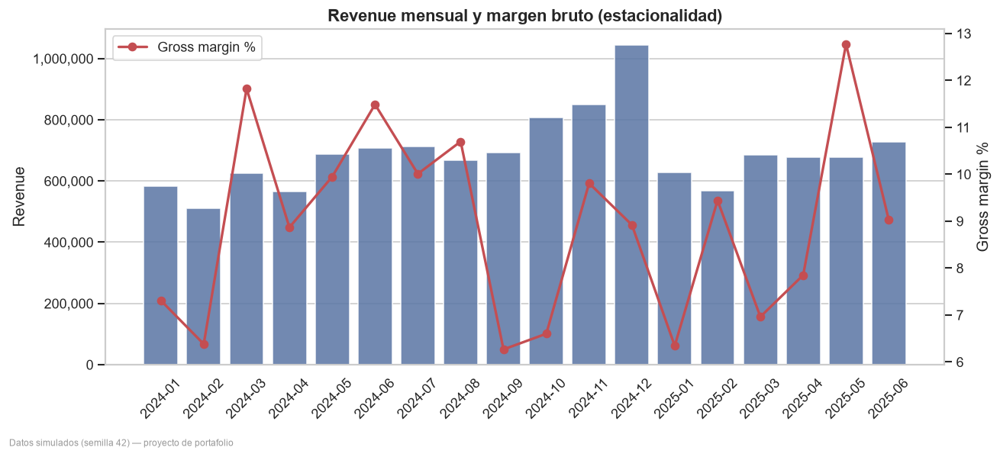
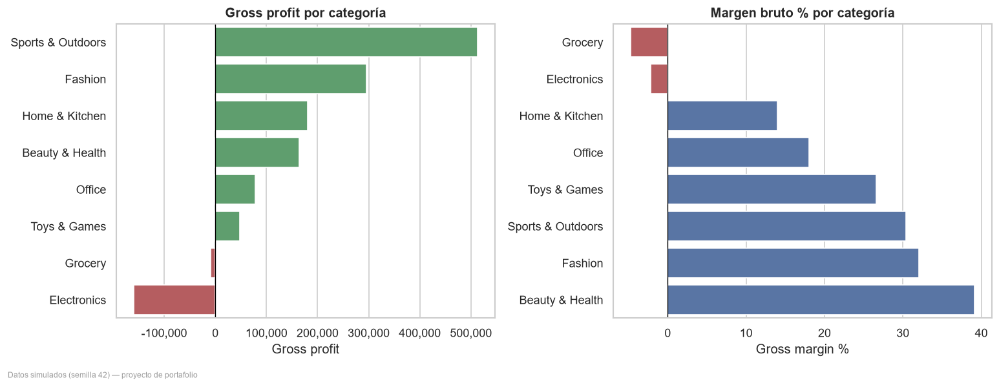
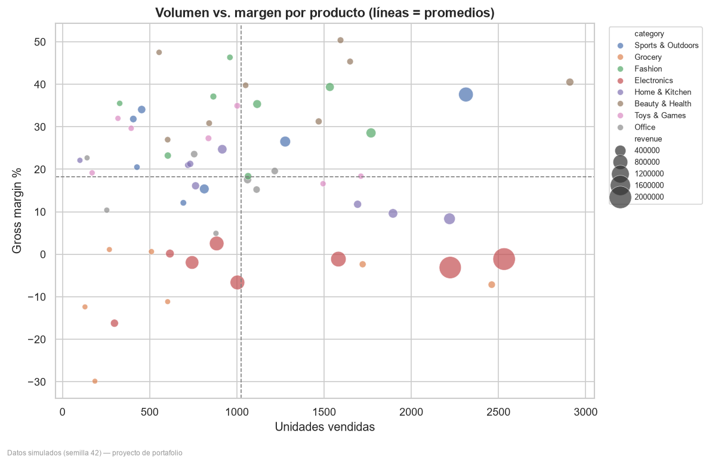
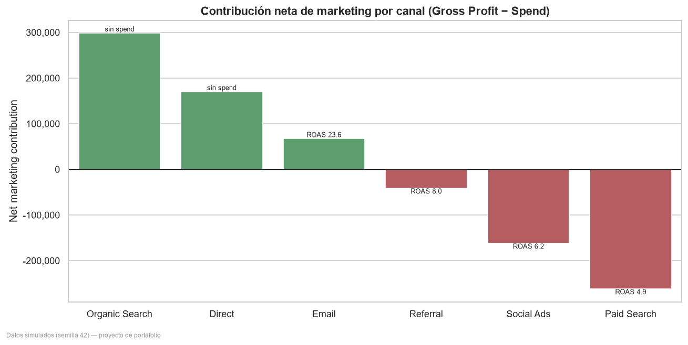
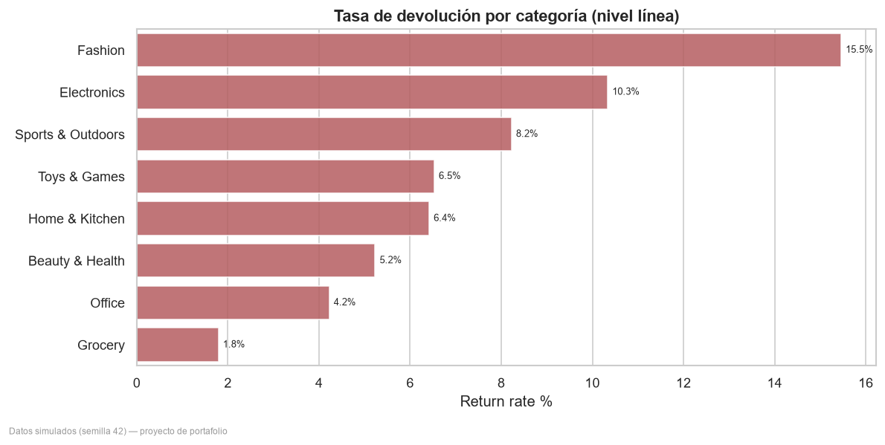
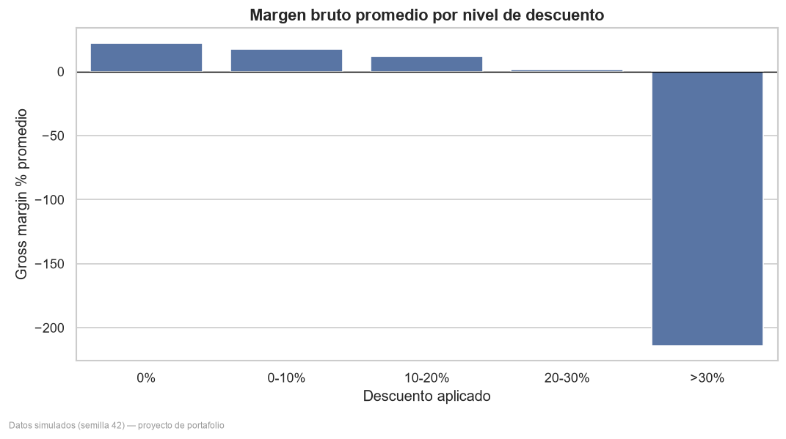
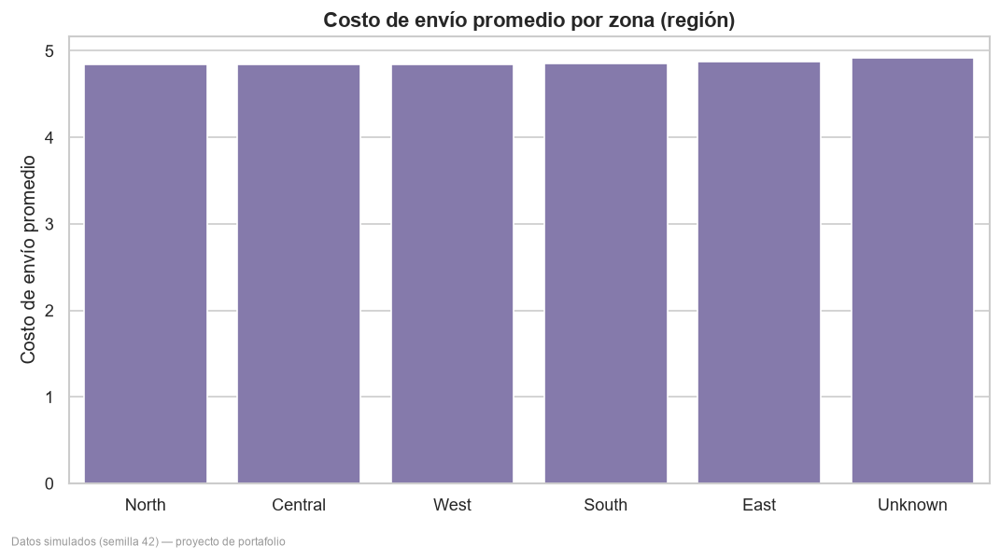
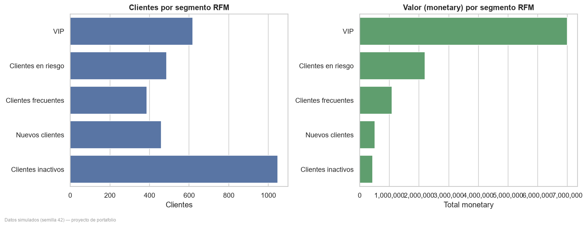
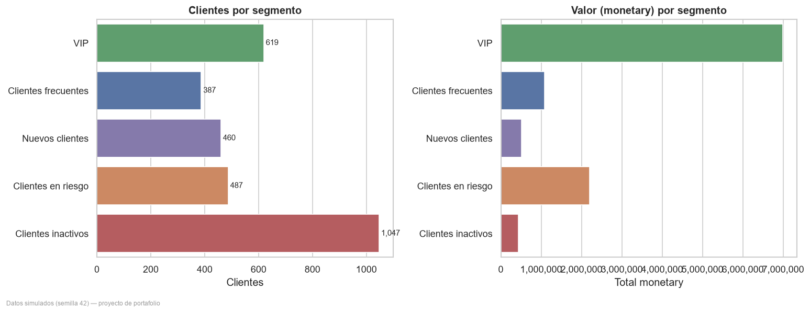
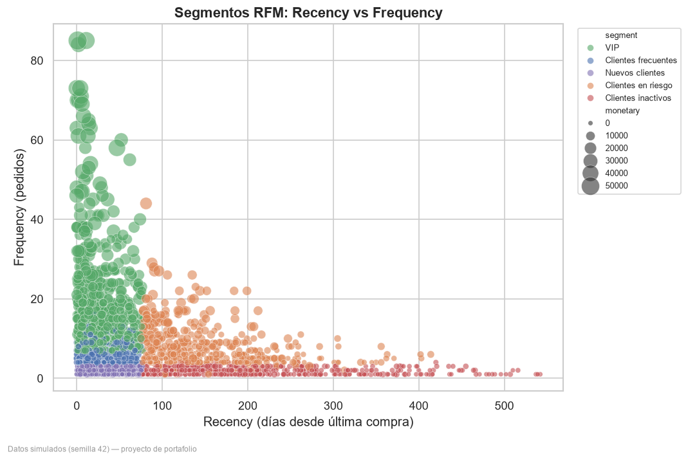

# E-commerce Profitability Analytics

### De los datos a las decisiones rentables

> ⚠️ **Datos simulados — proyecto demostrativo.** Este proyecto utiliza un dataset
> **generado sintéticamente** con una semilla aleatoria fija (`RANDOM_SEED = 42`).
> **No contiene datos reales, personales ni confidenciales.** Todas las cifras son
> ilustrativas y existen únicamente para demostrar competencias analíticas en un
> contexto de portafolio. No deben interpretarse como resultados de un negocio real.

Proyecto de portafolio de **Business Analytics / Data Analytics** que analiza la
rentabilidad de un e-commerce y convierte datos comerciales en recomendaciones
accionables sobre productos, categorías, canales de marketing y clientes. Cubre el
pipeline completo: **generación de datos → limpieza → validación → base de datos
analítica → SQL → análisis en Python → segmentación RFM → dashboard Power BI**.

---

## 1. Problema de negocio

Un e-commerce genera ingresos, pero **no todos los ingresos son igual de rentables**.
La dirección necesita responder, con evidencia cuantitativa:

1. ¿Qué productos y categorías generan mayor rentabilidad?
2. ¿Qué productos venden mucho pero con bajo margen?
3. ¿Qué canales de marketing son más eficientes (CAC / ROAS)?
4. ¿Qué segmentos de clientes generan más valor?
5. ¿Dónde hay oportunidades para mejorar el margen?
6. ¿Qué decisiones debería tomar un gerente de e-commerce?

## 2. Objetivo

Construir un **pipeline reproducible** que transforme datos transaccionales en
hallazgos y recomendaciones priorizadas sobre dónde se gana y se pierde margen, y
entregarlos en un **informe ejecutivo** y un **dashboard** listo para la gerencia.

## 3. Datos utilizados

**Dataset simulado** de 18 meses (2024-01 a 2025-06), reproducible con semilla fija.
Modelo dimensional tipo estrella:

| Tabla | Tipo | Filas | Contenido |
|---|---|---:|---|
| `dim_date` | Dimensión | 547 | Calendario diario (año, trimestre, mes, semana, día) |
| `dim_product` | Dimensión | 60 | 8 categorías, marca, proveedor, costo, precio |
| `dim_customer` | Dimensión | 3,000 | Segmento, ciudad, región, canal y fecha de adquisición |
| `dim_channel` | Dimensión | 6 | Canales de adquisición y su tipo |
| `fact_sales` | Hechos | 32,083 líneas / 20,000 pedidos | Ventas, costos, descuentos, envío, devoluciones |
| `fact_marketing` | Hechos | 2,188 | Inversión, impresiones, clics y conversiones por canal/campaña |

Se inyectan **nulos e inconsistencias controladas** (~1%) de forma deliberada para
ejercitar la capa de validación. Los datos crudos viven en `data/raw/` y los datos
limpios en `data/processed/` (regenerables, no versionados).

## 4. Arquitectura

```text
config.py (parámetros + semilla)
   │
generate_data.py → clean_data.py → validate_data.py → load_database.py → ecommerce.db (SQLite)
                                                                              │
                                    ┌─────────────────────────────────────────┤
                                 run_sql.py            analysis.py    customer_segmentation.py
                              (sql/01–05)          (KPIs + figuras)        (RFM → customer_rfm.csv)
                                    │                     │                       │
                                    └──────────── Power BI (modelo estrella + DAX) ┘
```

Modelo estrella: `fact_sales` y `fact_marketing` rodeadas de `dim_date`,
`dim_product`, `dim_customer` y `dim_channel` (nombres lógicos en PascalCase en
`CLAUDE.md`; físicos en snake_case en la implementación).

## 5. Estructura de carpetas

```text
ecommerce-profitability-analytics/
├── data/            # raw/ y processed/ (datos regenerables, no versionados)
├── database/        # schema.sql, seed.sql, ecommerce.db
├── notebooks/       # (opcional) exploración en Jupyter
├── src/             # pipeline: config, generación, limpieza, validación, carga, análisis, RFM
├── sql/             # 5 consultas analíticas documentadas
├── powerbi/         # diccionario de datos, medidas DAX y especificación del dashboard
├── reports/         # resumen ejecutivo, hallazgos, supuestos, limitaciones, figuras
├── presentation/    # caso de estudio para LinkedIn
└── tests/           # pruebas de calidad de datos y de cálculos
```

## 6. Proceso de transformación

1. **Generación** (`generate_data.py`): crea las 6 tablas con estacionalidad, márgenes
   realistas por categoría, devoluciones, descuentos y costos logísticos.
2. **Limpieza** (`clean_data.py`): tipa columnas, resuelve nulos e inconsistencias
   inyectadas, elimina duplicados y estandariza claves.
3. **Validación** (`validate_data.py`): 15 chequeos de calidad independientes (claves
   duplicadas, nulos, fechas fuera de rango, cantidades ≤ 0, precios/costos negativos,
   márgenes fuera de rango, pedidos huérfanos, cuadre de totales fuente vs. procesado).
4. **Carga** (`load_database.py`): construye `ecommerce.db` (SQLite) desde `schema.sql`
   y carga las tablas procesadas.
5. **Análisis** (`analysis.py`, `run_sql.py`, `customer_segmentation.py`): calcula KPIs,
   ejecuta las consultas SQL, genera 10 figuras y la segmentación RFM.

## 7. Consultas SQL principales

| Archivo | Análisis |
|---|---|
| `sql/01_revenue_analysis.sql` | Revenue, profit y crecimiento MoM por mes |
| `sql/02_profitability_analysis.sql` | Margen por categoría/producto, top-10 contribución, alto volumen–bajo margen, devoluciones |
| `sql/03_channel_performance.sql` | CAC, ROAS y contribución neta por canal y campaña |
| `sql/04_customer_rfm.sql` | Segmentación RFM y clientes en riesgo |
| `sql/05_data_quality.sql` | Cuadre de totales y chequeos de integridad |

## 8. Análisis realizado

Revenue y profit por mes y por categoría · margen por producto · productos de alto
volumen y bajo margen · productos de bajo volumen y alto margen · rentabilidad por
canal · CAC y ROAS por canal · rendimiento por campaña · segmentación RFM · clientes
en riesgo · devoluciones por categoría · costos de envío por zona · relación
descuento–margen · estacionalidad · top-10 productos por contribución al margen.

Las 10 figuras resultantes están en [`reports/figures/`](reports/figures/).

### Vista previa de análisis

> 🖼️ Figuras generadas con **Python (matplotlib/seaborn)** a partir del dataset
> simulado. Sirven como anticipo de los análisis; el dashboard interactivo de
> Power BI se documenta en [`powerbi/`](powerbi/).

<table>
  <tr>
    <td width="50%"><br><sub><b>Revenue y margen mensual</b> — tendencia y estacionalidad.</sub></td>
    <td width="50%"><br><sub><b>Gross profit y margen por categoría</b> — dónde se gana y se pierde.</sub></td>
  </tr>
  <tr>
    <td width="50%"><br><sub><b>Volumen vs. margen por producto</b> — alto volumen / bajo margen.</sub></td>
    <td width="50%"><br><sub><b>Contribución neta por canal</b> — rentabilidad tras marketing.</sub></td>
  </tr>
  <tr>
    <td width="50%"><br><sub><b>Devoluciones por categoría</b> — tasa de retorno y reembolsos.</sub></td>
    <td width="50%"><br><sub><b>Descuento vs. margen</b> — impacto del descuento en la rentabilidad.</sub></td>
  </tr>
  <tr>
    <td width="50%"><br><sub><b>Costos de envío por región</b> — fugas logísticas por zona.</sub></td>
    <td width="50%"><br><sub><b>Segmentos RFM</b> — distribución de la base de clientes.</sub></td>
  </tr>
  <tr>
    <td width="50%"><br><sub><b>Tamaño y valor por segmento</b> — concentración de valor.</sub></td>
    <td width="50%"><br><sub><b>Recencia vs. frecuencia</b> — VIP, frecuentes y clientes en riesgo.</sub></td>
  </tr>
</table>

## 9. Indicadores (valores del dataset simulado)

| Indicador | Valor |
|---|---:|
| Total Revenue | **12,417,781** |
| Gross Profit | **1,111,339** |
| Gross Margin % | **8.9%** |
| Pedidos | **20,000** |
| Líneas de venta | 32,083 |
| Average Order Value | ~621 |
| Marketing Spend total | 1,042,143 |
| Categorías con profit negativo | 2 (Electronics, Grocery) |
| Concentración top-10 productos | **75.1%** del gross profit |

Otros KPIs calculados: Return Rate, Average Discount, CAC, ROAS, Net Marketing
Contribution, Revenue per Customer, Repeat Purchase Rate, CLV aproximado y
crecimiento MoM de revenue y gross profit. Definiciones de negocio en
[`CLAUDE.md`](CLAUDE.md) y medidas DAX en [`powerbi/dax_measures.md`](powerbi/dax_measures.md).

## 10. Hallazgos

1. **El revenue no es rentabilidad.** `Electronics` es la categoría de **mayor
   revenue** (7.3 M) pero **destruye margen** (−159,730; −2.2%). Junto a `Grocery`
   (−8,721) suman las dos únicas categorías con profit negativo.
2. **Los canales pagados no se sostienen tras marketing.** `Paid Search` tiene
   contribución neta **−262,342** (ROAS 4.9); `Social Ads` **−162,554**. Los canales
   sin inversión (`Organic` + `Direct`) aportan **468,791** de gross profit.
   `Email` es el pagado más eficiente (ROAS 23.6).
3. **Beneficio muy concentrado:** los 10 productos top explican el **75.1%** del gross
   profit; `Cobalt Sports Max` solo el **26.3%** (riesgo de concentración).
4. **Estacionalidad Q4 con margen comprimido:** pico en 2024-12 (revenue 1.04 M) y la
   mayor caída MoM en 2025-01 (−39.9%).
5. **Devoluciones premium:** `Fashion` devuelve el **15.5%** de sus líneas; `Electronics`
   concentra el mayor reembolso en dinero (772,919).
6. **Fugas operativas:** las líneas con descuento rinden ~8.7% de margen vs. ~22.3% sin
   descuento, y el envío genera pérdida neta (−40,489).

Hallazgos completos en [`reports/findings.md`](reports/findings.md).

## 11. Recomendaciones

- **Rescatar el margen de Electronics/Grocery:** renegociar costos, acotar SKUs no
  rentables, revisar precios y reducir devoluciones/descuentos.
- **Reasignar presupuesto de marketing** desde `Paid Search`/`Social Ads` hacia `Email`
  y refuerzo de orgánico; auditar la atribución antes de escalar.
- **Proteger los productos núcleo** (alertas de stock y precio) y diversificar la base
  rentable para reducir el riesgo de concentración.
- **Planificar Q4** (inventario y marketing) protegiendo el margen del pico.
- **Retención dirigida:** fidelizar `VIP`/`Clientes frecuentes` y recuperar `Clientes en riesgo`.

## 12. Supuestos

Datos simulados con semilla fija; atribución de canal de único toque (canal del
pedido); umbrales de "alto/bajo" definidos por el promedio; CLV aproximado por
`monetary`; moneda única. Detalle en [`reports/assumptions.md`](reports/assumptions.md).

## 13. Limitaciones

Los patrones no representan un negocio real; sin factores externos (competencia,
macro, stock-outs); RFM descriptivo, no predictivo; alcance analítico, no
transaccional. Detalle en [`reports/limitations.md`](reports/limitations.md).

## 14. Próximas mejoras

- Modelo de atribución multitáctil y CLV probabilístico (BG/NBD).
- Elasticidad precio–demanda y simulación de escenarios de descuento.
- Orquestación del pipeline (Makefile / CLI) y CI para las pruebas.
- Notebooks de exploración y publicación del dashboard en Power BI Service.

---

## Instalación

Requisitos: **Python 3.11+** y **Git**.

```bash
git clone <repo-url>
cd ecommerce-profitability-analytics
python -m venv .venv
# Windows PowerShell:  .venv\Scripts\Activate.ps1
# macOS/Linux:         source .venv/bin/activate
python -m pip install -r requirements.txt
```

## Reproducir el proyecto (de cero)

```bash
python -m src.generate_data          # genera datos simulados en data/raw/
python -m src.clean_data             # limpieza → data/processed/
python -m src.validate_data          # 31 reglas de calidad sobre data/raw/
python -m src.load_database          # construye database/ecommerce.db
python -m src.run_sql                # ejecuta sql/01–05 → analysis_outputs/
python -m src.analysis               # KPIs + figuras en reports/figures/
python -m src.customer_segmentation  # RFM → data/processed/customer_rfm.csv
pytest -q                            # 27 pruebas de calidad y cálculos
```

La semilla fija garantiza que **todos los resultados son idénticos en cada ejecución**.

## Conexión con Power BI

Cargar las tablas de `data/processed/` (o conectar directamente a `database/ecommerce.db`),
relacionar el modelo estrella según [`powerbi/data_dictionary.md`](powerbi/data_dictionary.md),
crear las medidas de [`powerbi/dax_measures.md`](powerbi/dax_measures.md) y construir las
5 páginas descritas en [`powerbi/dashboard_specification.md`](powerbi/dashboard_specification.md).

## Estado del proyecto

- [x] **Fase 0** — Inspección del entorno
- [x] **Fase 1** — Estructura del proyecto y archivos base
- [x] **Fase 2** — Generador de datos simulados
- [x] **Fase 3** — Limpieza y validación
- [x] **Fase 4** — Base SQLite
- [x] **Fase 5** — Consultas SQL
- [x] **Fase 6** — Análisis exploratorio
- [x] **Fase 7** — Segmentación RFM
- [x] **Fase 8** — Documentación y medidas DAX
- [x] **Fase 9** — Documentación profesional y pruebas
- [x] **Fase 10** — Revisión final: pipeline reproducido de cero (24/24 artefactos byte-idénticos), 27 pruebas en verde

## Contacto

**Karen Pineda** — Business Analyst / Data Analyst
📧 pineda.karen@gmail.com

## Licencia

Distribuido bajo licencia [MIT](LICENSE).
